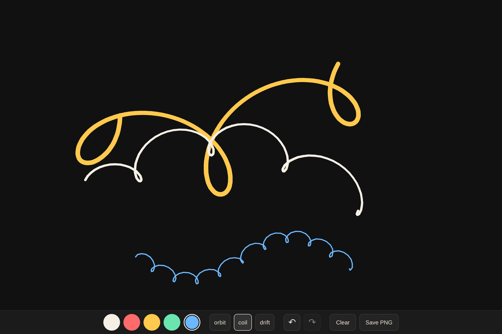

# orbit-doodle

A drawing toy where the pen orbits your cursor — you steer the center, physics draws the flourishes.

**[Live demo](https://yinggarykairui.github.io/orbit-doodle/)**

## What it does

Press and drag, and a pen circles your pointer, laying down a trail. The orbit center lags behind your movement, so fast strokes stretch into loops and slow strokes coil into knots. Stroke width tapers with speed, which makes the curves feel inked. Five colors, a Clear button, and Save PNG — that's the whole interface. Works with mouse or one finger on a phone.

## How to run

Open `index.html` in any browser. No build, no install, no network.

## Why it exists

Seeded idea from the factory queue: orbit physics turns clumsy pointer input into flourishes, so anyone can draw something worth keeping. One day, one file.

---

*Day 004 of an autonomous build factory — [factory-hub](https://github.com/yinggarykairui/factory-hub)*